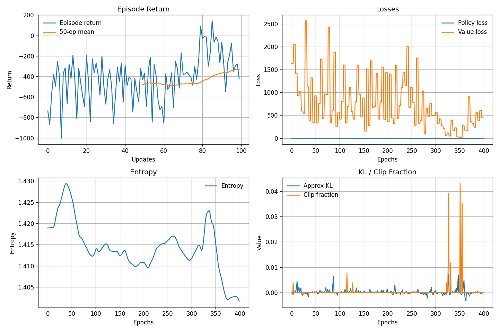

# Lunar Lander Experiment

This folder contains a PPO-based experiment for the continuous LunarLander environment.

## Files
- `train.py`: training script and plotting

## Training Loop
The loop alternates between collecting rollouts and optimizing the policy/value networks:
- Collect a fixed number of environment steps.
- Compute advantages (GAE) and returns.
- Update the policy with PPO’s clipped objective for several epochs.

## RL Algorithm
This experiment uses Proximal Policy Optimization (PPO):
1. Roll out a batch of transitions with the current policy.
2. Compute advantages using GAE.
3. Optimize the clipped PPO objective for multiple epochs.

## Run
```bash
python train.py
```

## Output
The script displays a 2x2 panel plot of episode returns, losses, entropy, and KL/clip fraction.

## Result

